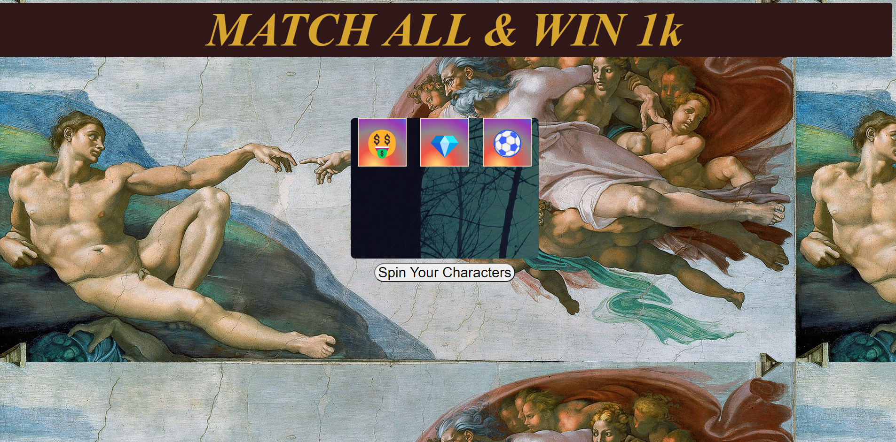

# SLOT MACHINE.  [PLAY GAME](https://kabzeel1.github.io/Unit1-Slotmachine-Project/)
# slot machines history?
Slot machines have been around for many years now. They were initially introduced in the late 1800s and mainly played in casinos and similar venues. But now we can make these games on our computers and play them anywhere.

## how to play this game.

With this game, you have a chance to win 1000 dollars. This will happen every time you match 3 of the characters on the board.

## how the game was made.
This game was made by the help of the following programming tools.

- ***Javascript*** : this was used to bring forth the behavior of the game.

- ***HTML*** : which helped to link with all the other languages and make them compatible with the web.

- ***CSS*** : CSS helped with the styling of the game.

## Whats next?

This is not the end of the road for this app. It is sure to be evolved and made even more exciting and challenging, with spinning effects, bettings and AI in this soon coming future so ***PLEASE*** stay tuned.